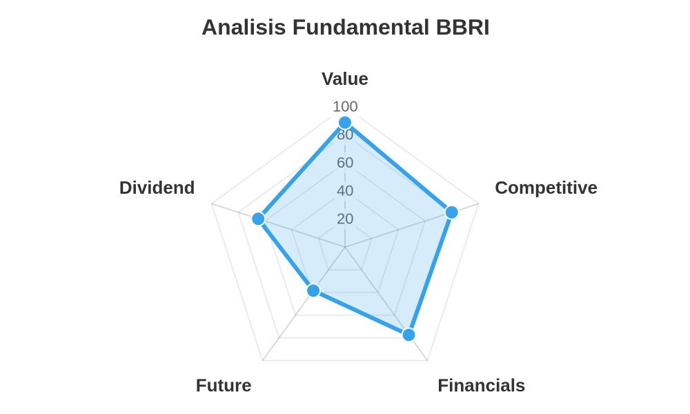

<div align="center">
  
  
  # Nyangkut Doctor
</div>

**Nyangkut Doctor** adalah bot asisten yang membantu investor ritel Indonesia yang bingung menghadapi saham rugi ("nyangkut") dengan analisis fundamental otomatis dan pemantauan berkala, sehingga keputusan hold atau cut loss didasarkan pada data.

Dibangun untuk **Sectors Hackathon 2026** — Track 01: AI Agents & Assistants.

> ⚠️ **Disclaimer:** bot ini menganalisis kesehatan fundamental perusahaan (laba, utang, valuasi), bukan prediksi harga saham. Ini adalah alat bantu analisis dan edukasi, bukan rekomendasi investasi. Semua keputusan tetap di tangan pengguna.

---

## Masalah yang Diselesaikan

Banyak investor ritel membeli saham tanpa memahami fundamentalnya, dan begitu harga turun ("nyangkut"), mereka cenderung menghindar untuk mengecek kondisinya lebih lanjut, padahal justru saat itu paling krusial untuk tahu apakah perlu *hold* (fundamental masih sehat) atau *cut loss* (fundamental memburuk). Nyangkut Doctor menjawab dua kebutuhan ini:

1. **Analisis on-demand** — kirim ticker, dapat diagnosis fundamental lengkap.
2. **Pemantauan proaktif** — daftarkan saham ke watchlist, bot akan memberi tahu secara otomatis kalau ada perubahan fundamental signifikan, tanpa perlu diminta.

---

## Fitur Utama

### 1. Analisis Fundamental per Ticker
Kirim `TICKER HARGA_BELI` (contoh: `BBRI 5200`) ke bot, dan dapatkan:
- Diagnosis kesehatan fundamental (Sehat / Waspada / Kritis / Data terbatas)
- Metrik kunci: PBV, PE, DER, EPS Growth, dibandingkan rata-rata historis & sektor
- Perbandingan dengan emiten sejenis (peer comparison)
- Radar chart visual (Value, Competitive, Financials, Future, Dividend)
- Rekomendasi substitusi ke emiten sejenis yang lebih murah (jika valuasi mahal)



#### Cara Membaca Radar Chart

Tiap sumbu bernilai 0–100, semakin jauh titik dari pusat, semakin kuat saham di dimensi tersebut:

| Sumbu | Dihitung dari | Skor tinggi berarti |
|---|---|---|
| **Value** | PBV saat ini vs rata-rata PBV emiten sejenis (peer) | Valuasi tergolong murah dibanding kompetitor sesektor |
| **Competitive** | Peringkat kapitalisasi pasar (`market_cap_rank`) di sektornya | Termasuk pemain besar/dominan di sektornya |
| **Financials** | Forward PE | Valuasi laba ke depan tergolong wajar/murah |
| **Future** | Pertumbuhan EPS tahun berjalan vs tahun lalu | Prospek pertumbuhan laba yang kuat |
| **Dividend** | Dividend yield TTM (trailing twelve months) dari data Sectors API, diskalakan ke rentang 0–100 | Emiten memiliki yield dividen yang tinggi secara historis |
> Untuk emiten yang datanya belum tersedia di Sectors API, skor Dividend menggunakan nilai fallback default.

**Contoh pembacaan:** pada chart di atas, BBRI menunjukkan **Value**, **Competitive**, dan **Dividend** yang tinggi (titik jauh dari pusat) artinya valuasi tergolong murah,termasuk bank besar di sektornya, dan memiliki yield dividen yang tinggi secara historis. **Financials**berada di level menengah, sementara **Future** adalah titik yang paling dekat ke pusat menandakan ini kelemahan utamanya (pertumbuhan laba sedang melambat). Bentuk pentagon yang "condong" ke satu sisi seperti ini membantu investor langsung melihat di mana kekuatan dan kelemahan utama emiten tersebut, tanpa perlu membaca semua angka satu per satu.

> > **Catatan:** skala pada chart selalu tetap di rentang 0–100, dengan grid tiap kelipatan 20. Untuk membaca dengan cepat, fokus pada **jarak relatif tiap titik dari pusat** dibanding angka presisi pada grid.

### 2. Watchlist & Pemantauan Otomatis
- `/watch TICKER [HARGA]` — tambahkan saham ke watchlist (maks. 5 ticker per user)
- `/unwatch TICKER` — hapus dari watchlist
- `/mywatchlist` — lihat daftar yang sedang dipantau
- Setiap hari, bot mengecek ulang data fundamental semua ticker di watchlist. Notifikasi Telegram otomatis dikirim **hanya** jika ada perubahan signifikan (PBV berubah >20%, atau status untung/rugi berbalik).

### 3. Riwayat Analisis
- `/history` — lihat riwayat analisis yang pernah dilakukan, tersimpan di database.

---

## Arsitektur & Tech Stack

| Komponen | Teknologi |
|---|---|
| Bot interface | Telegram (`python-telegram-bot`) |
| Sumber data fundamental | [Sectors API](https://sectors.app) — company report, screener, daily price |
| Model bahasa (diagnosis) | LLM via endpoint kompatibel OpenAI (dikonfigurasi lewat `.env`) |
| Database | Supabase (PostgreSQL) — tabel `users`, `analyses`, `watchlist` |
| Scheduler | `JobQueue` bawaan `python-telegram-bot` (berjalan 1x/hari) |
| Visualisasi | QuickChart (radar chart) |

Sectors API menjadi **sumber data inti** — tanpa itu, bot kehilangan seluruh fungsi analisisnya (fetch company report, peer screening, dan data harga harian).

---

## Cara Menjalankan

### 1. Prasyarat
- Python 3.10+
- Akun [Sectors API](https://sectors.app) dengan API key
- Bot Telegram (buat lewat [@BotFather](https://t.me/BotFather))
- Project [Supabase](https://supabase.com) dengan 3 tabel: `users`, `analyses`, `watchlist`
- Akses ke LLM endpoint kompatibel OpenAI (mis. via proxy lokal atau layanan API)

### 2. Instalasi
```bash
git clone <repo-url>
cd nyangkut-doctor
pip install python-telegram-bot[job-queue] requests supabase python-dotenv
```

### 3. Konfigurasi
Buat file `.env` di root folder:
```env
TELEGRAM_BOT_TOKEN=your_telegram_bot_token
SECTORS_API_KEY=your_sectors_api_key
SUPABASE_URL=your_supabase_url
SUPABASE_SERVICE_KEY=your_supabase_service_key
LLM_BASE_URL=http://localhost:20128/v1
LLM_MODEL=your_model_name
HERMES_CUSTOM_LOCALHOST_20128_API_KEY=your_llm_api_key
```

> ⚠️ **Jangan pernah commit file `.env` ke repository.** Pastikan sudah masuk `.gitignore`.

### 4. Setup Database (Supabase)
Jalankan SQL berikut di Supabase SQL Editor:
```sql
CREATE TABLE users (
    id BIGINT GENERATED ALWAYS AS IDENTITY PRIMARY KEY,
    telegram_id BIGINT UNIQUE NOT NULL,
    username TEXT,
    full_name TEXT,
    created_at TIMESTAMPTZ DEFAULT now()
);

CREATE TABLE analyses (
    id BIGINT GENERATED ALWAYS AS IDENTITY PRIMARY KEY,
    user_id BIGINT REFERENCES users(id),
    ticker TEXT NOT NULL,
    buy_price NUMERIC,
    diagnosis TEXT,
    resep_dokter TEXT,
    created_at TIMESTAMPTZ DEFAULT now()
);

CREATE TABLE watchlist (
    id BIGINT GENERATED ALWAYS AS IDENTITY PRIMARY KEY,
    user_id BIGINT REFERENCES users(id),
    ticker TEXT NOT NULL,
    buy_price NUMERIC,
    last_snapshot JSONB,
    created_at TIMESTAMPTZ DEFAULT now(),
    UNIQUE(user_id, ticker)
);
```

### 5. Jalankan Bot
```bash
python main.py
```

---

## Daftar Perintah

| Perintah | Fungsi |
|---|---|
| `/start` | Info & disclaimer bot |
| `TICKER [HARGA]` | Analisis fundamental (contoh: `BBRI 5200`) |
| `/watch TICKER [HARGA]` | Tambah ke watchlist |
| `/unwatch TICKER` | Hapus dari watchlist |
| `/mywatchlist` | Lihat watchlist saat ini |
| `/history` | Riwayat analisis sebelumnya |

---

## Ketahanan & Penanganan Error

- **Rate limit / kredit API habis**: `sectors_get()` membedakan antara rate limit sementara (retry dengan exponential backoff) dan kredit API habis (gagal cepat, tidak retry percuma).
- **Scheduler tangguh**: pengecekan watchlist harian membungkus setiap ticker dalam `try/except` terpisah — kegagalan pada satu ticker tidak menghentikan pengecekan ticker lainnya.

---

## Batasan yang Diketahui

- Data fundamental bergantung sepenuhnya pada ketersediaan dan kelengkapan data dari Sectors API.
- Analisis LLM dapat memiliki keterbatasan dalam menangkap konteks pasar yang sangat baru (mis. berita terkini) di luar data numerik yang diberikan.
- Bot ini **tidak melakukan eksekusi transaksi** apa pun, murni alat bantu analisis dan pemantauan.
